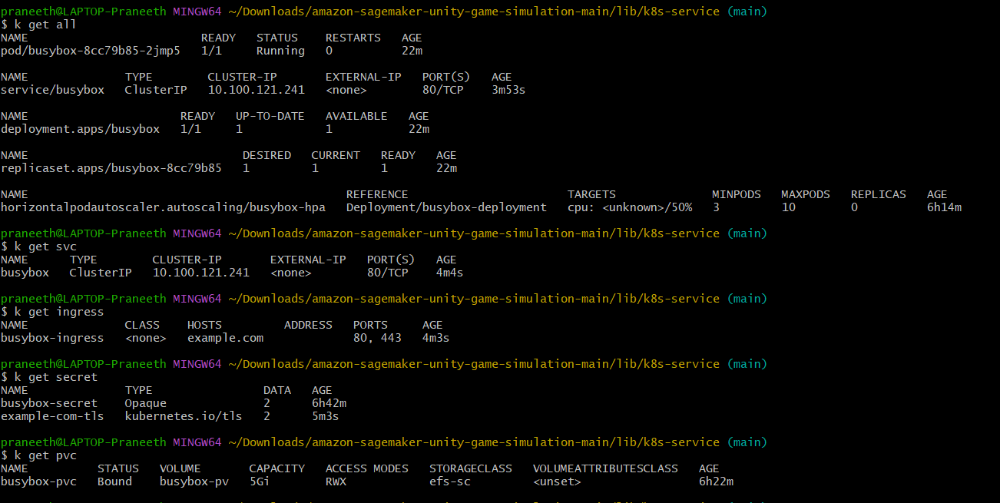

# Kubernetes Deployment with AWS EFS and HPA Affinity

This repository contains the YAML files and configurations required for deploying applications using Kubernetes on AWS. The deployment includes key components such as:

- **Deployment**: Defines the application deployment in Kubernetes.
- **Service**: Manages the application's internal or external exposure.
- **Secret**: Stores sensitive information, such as credentials or certificates.
- **ConfigMap**: Provides configuration data for the application.
- **Persistent Volume (PV) with AWS EFS**: Persistent storage using AWS Elastic File System (EFS).
- **Ingress with SSL**: Manages external access to the services with SSL termination.
- **Horizontal Pod Autoscaler (HPA) with Affinity**: Configures HPA with zone-aware pod distribution, ensuring an equal number of pods are distributed across zones.

## Architecture Overview

The following diagram illustrates the deployment architecture, showcasing how the services interact, the use of AWS EFS for persistent storage, and HPA for scaling based on resource usage.



## Generating Self-Signed SSL Certificates

In this project, SSL certificates are used for securing ingress traffic. You can generate a self-signed SSL certificate using the `openssl` commands below:

```bash
# Generate the TLS key
openssl genrsa -out tls.key 2048

# Generate the self-signed certificate
openssl req -x509 -new -nodes -key tls.key -sha256 -days 365 -out tls.crt -subj "/CN=example.com/O=My Organization"

